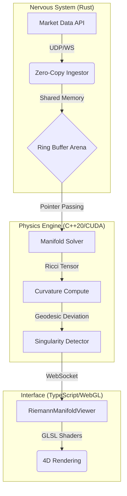

<p align="center">
  <h1 align="center">Tensorwerk</h1>
  <p align="center"><b>Riemannian Geometry Engine for Financial Spacetime Simulation</b></p>
</p>

<p align="center">
  
  
  
  
  
  
</p>

<p align="center">
  
  
  
  
  
</p>

---

## 🌍 **Documentation / Documentação**

**📖 [🇺🇸 Read in English](README_EN.md)** — Comprehensive technical deep dive (Architecture, Math, APIs).  
**📖 [🇧🇷 Leia em Português](README_PT.md)** — Documentação técnica completa + analogias científicas.

---

## ⚡ What is Tensorwerk?

**Tensorwerk** is a **Financial Physics Engine** that models market dynamics as a 4-dimensional Riemannian manifold. By treating money as energy and price movements as curvature in spacetime, it detects structural instabilities (crashes) as geometric singularities *before* they manifest as price drops.

### 🏆 Key Highlights

- **Physics-Based Prediction**: Uses General Relativity field equations instead of statistical regression.
- **Ultra-Low Latency**: **Rust** ingestor processes market data in **< 10μs** with zero-copy architecture.
- **Massive Parallelism**: **C++20/CUDA** engine solves differential geometry on **AVX-512** & GPU Tensor Cores.
- **Real-Time Visualization**: **WebGL/React** interface renders the "Neural Circuitry" of the market, identifying connections and singularities in 4D.
- **Meta-Programming**: **LISP** kernel generates optimized C++ code for new financial instruments at runtime.

---

## 🏗️ Architecture Overview



---

## 🚀 Quick Start

### Option 1: Docker (Recommended)
```bash
docker build -f docker/production.Dockerfile -t tensorwerk:latest .
docker run --gpus all -p 3000:3000 tensorwerk:latest
```

### Option 2: From Source
```bash
# Clean, Build, and Run all services (C++, Rust, Web)
make clean && make dev && make run
```

---

## 📞 Contact

**Thiago Di Faria** — [thiagodifaria@gmail.com](mailto:thiagodifaria@gmail.com)

[](https://github.com/thiagodifaria)

---

### 🌟 **Star this project if you're interested in Geometric Finance!**

**Made with ❤️ by [Thiago Di Faria](https://github.com/thiagodifaria)**
