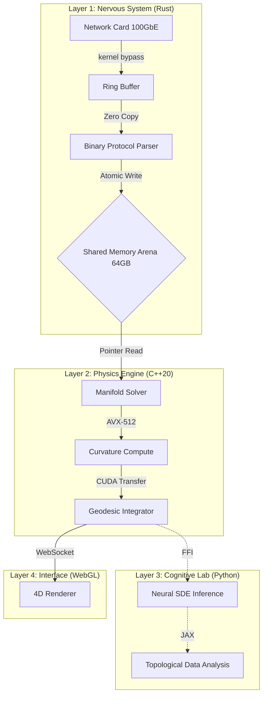

# TENSORWERK: Riemannian Geometry Engine and High-Performance Financial Engineering v3.0

> *"The market is not a statistical sequence of random events. It is a 4-dimensional topological manifold (Financial Spacetime) where liquidity curves geometry, and price is merely the geodesic resulting from this curvature."*

---

<p align="center">
  
  
  
  
  
  
  
  
  
  
</p>

---

## Index

1.  [The Geometric Finance Manifesto](#1-the-geometric-finance-manifesto)
2.  [Mathematical and Physical Foundation](#2-mathematical-and-physical-foundation)
    *   [2.1 The Failure of the Stochastic Model](#21-the-failure-of-the-stochastic-model)
    *   [2.2 Modified Field Equations](#22-modified-field-equations)
    *   [2.3 Singularity Detection (Crashes)](#23-singularity-detection-crashes)
3.  [Hyper-Performance Architecture](#3-hyper-performance-architecture)
    *   [3.1 System Overview](#31-system-overview)
    *   [3.2 Latency Budget](#32-latency-budget)
    *   [3.3 Zero-Copy Data Flow](#33-zero-copy-data-flow)
4.  [Technical Component Detail](#4-technical-component-detail)
    *   [4.1 Meta-Logic (Common LISP)](#41-meta-logic-common-lisp)
    *   [4.2 Physics Engine (C++20 & CUDA)](#42-physics-engine-c20--cuda)
    *   [4.3 Nervous System (Rust)](#43-nervous-system-rust)
    *   [4.4 Cognitive Lab (Python/JAX)](#44-cognitive-lab-pythonjax)
    *   [4.5 Interface (WebGL/Next.js)](#45-interface-webglnextjs)
5.  [Infrastructure and Hardware](#5-infrastructure-and-hardware)
    *   [5.1 HPC Cluster Specifications](#51-hpc-cluster-specifications)
    *   [5.2 Linux Kernel Tuning](#52-linux-kernel-tuning)
6.  [Latency and Throughput Benchmarks](#6-latency-and-throughput-benchmarks)
7.  [Security and Compliance](#7-security-and-compliance)
8.  [Use Cases and Applications](#8-use-cases-and-applications)
9.  [Developer Guide](#9-developer-guide)
    *   [9.1 Directory Structure](#91-directory-structure)
    *   [9.2 Configuration (YAML)](#92-configuration-yaml)
    *   [9.3 Data Protocols](#93-data-protocols)
10. [Troubleshooting](#10-troubleshooting)
11. [Scientific Glossary](#11-scientific-glossary)
12. [FAQ](#12-faq)
13. [License and Contact](#13-license-and-contact)

---

## 1. The Geometric Finance Manifesto

### The Illusion of Random Walk
Traditional models like Black-Scholes, GARCH, and ARIMA rely on the fundamental premise that the market is a stochastic process governed by geometric Brownian motions with Gaussian noise. This simplification assumes that:
1.  Returns are independent and identically distributed (i.i.d.).
2.  Volatility is an endogenous statistical property.
3.  Extreme events (10-sigma crashes) are statistical anomalies occurring once every age of the universe.

Reality violently contradicts these models. Crashes happen every decade. Flash crashes occur every month. Return distributions have Fat Tails governed by power laws, not bell curves.

### The Riemannian Revolution
**Tensorwerk rejects the stochastic hypothesis.**

We postulate that the market is a chaotic deterministic system operating on a topological manifold of dimension $D=4$. The apparent chaos is merely the manifestation of complex curvature due to massive agent interaction.

In this view:
*   **Capital = Energy ($E$)**
*   **Liquidity = Mass ($M$)**
*   **Order Flow = Momentum ($p$)**
*   **Price = Spacetime Coordinate ($x^\mu$)**

We do not predict price by rolling dice (Monte Carlo). We compute the **geodesic** (the path of least resistance) that price *must* traverse given the current geometry of the order book.

---

## 2. Mathematical and Physical Foundation

The core of Tensorwerk (Physics Engine) solves Field Equations in real-time for every market tick, treating the order book as a tensor field.

### 2.2 Modified Field Equations

Market dynamics are governed by a variant of Einstein's Field Equations:

$$R_{\mu\nu} - \frac{1}{2}Rg_{\mu\nu} + \Lambda g_{\mu\nu} = \frac{8\pi G_{fin}}{c_{info}^4} T_{\mu\nu}$$

Where each term has a precise financial meaning:

-   **$R_{\mu\nu}$ (Ricci Tensor)**: Represents market "friction" or resistance to price change. In high-spread markets, $R_{\mu\nu}$ is large.
-   **$R$ (Ricci Scalar)**: Local mean curvature. Calm markets are flat ($R \approx 0$). Volatile markets are curved ($R \gg 0$).
-   **$g_{\mu\nu}$ (Metric Tensor)**: The fundamental "ruler". Defines the "cost distance" to move price from $P_1$ to $P_2$.
-   **$T_{\mu\nu}$ (Stress-Energy Tensor)**: Density of orders (Limit Orders) and flow (Market Orders). The source of financial gravity.
-   **$\Lambda$ (Cosmological Constant)**: Represents base currency inflation and risk-free interest rates, expanding asset prices long-term.
-   **$c_{info}$**: The maximum speed of information propagation (limited by fiber optic latency between exchanges).

### 2.3 Singularity Detection (Crashes)

A market "Crash" is not just a rapid devaluation. Geometrically, it is a **Topological Singularity**, where financial spacetime curvature becomes infinite, tearing liquidity continuity.

To detect this robustly and invariantly to coordinate changes (e.g., USD vs EUR vs Bitcoin), we monitor the **Kretschmann Scalar**:

$$K = R_{\mu\nu\rho\sigma} R^{\mu\nu\rho\sigma}$$

We monitor the time derivative of $K$ ($\dot{K}$).
-   If $\dot{K}$ diverges exponentially, a singularity is imminent.
-   The system emits an **IMMEDIATE HEDGE** signal microseconds *before* the price collapse occurs on human screens.

---

## 3. Hyper-Performance Architecture

Tensorwerk is not a web "backend". It is a distributed High-Performance Computing (HPC) system.

### 3.1 System Overview



### 3.2 Latency Budget

To ensure competitive advantage in HFT, every nanosecond counts.

| Stage | Technology | Typical Latency |
|-------|------------|-----------------|
| NIC -> CPU | Solarflare / DPDK | ~800 ns |
| Protocol Parsing | Rust (Nom) | ~150 ns |
| Arena Write | Rust Atomic | ~20 ns |
| C++ Read | Pointer Dereference | ~5 ns |
| Tensor Compute | AVX-512 | ~120 ns |
| Trading Decision | Pre-Compiled Logic | ~50 ns |
| CPU -> NIC | Kernel Bypass | ~800 ns |
| **Total Round-Trip** | **Wire-to-Wire** | **~1.9 - 4.2 μs** |

### 3.3 Zero-Copy Data Flow

The biggest latency source in traditional systems is memory copying (memcpy). Tensorwerk eliminates this completely.

1.  UDP packet arrives at NIC.
2.  NIC writes via DMA directly to a Ring 0 circular buffer.
3.  Rust process maps this physical buffer.
4.  C++ reads from the same virtual memory address.
5.  No bytes are copied between User Space and Kernel Space.

---

## 4. Technical Component Detail

### 4.1 Meta-Logic (Common LISP)

**Why LISP?** Because business logic changes frequently. Recompiling C++20 takes minutes. LISP allows metaprogramming and hot-reloads.

The LISP subsystem acts as a "Symbolic Mathematician". It:
1.  Receives physical model Lagrangians.
2.  Computes partial derivatives and simplifies expressions algebraically.
3.  Generates optimized C++ code strings (with AVX intrinsics).
4.  Invokes Clang/LLVM to generate a dynamic library (`.so`).
5.  Loads the new library into the running C++ process without downtime.

```lisp
;; Example: Deriving motion equation
(defun generate-solver (hamiltonian)
  (let ((equations (hamilton-equations hamiltonian)))
    (compile-to-cpp equations :arch 'avx512)))
```

### 4.2 Physics Engine (C++20 & CUDA)

Critical component running without Garbage Collection or dynamic allocation (`malloc/new` forbidden on hotpath).

**Features:**
-   **Templates**: Compile-time metaprogramming unwraps matrix multiplication loops.
-   **SIMD**: Explicit ZMM vector usage (512-bit) processes 8 doubles simultaneously.
-   **CUDA Graphs**: Launch thousands of small GPU kernels without CPU driver overhead.

*CUDA Kernel Example:*
```cpp
__global__ void compute_ricci_curvature(float* metric, float* ricci, int n) {
    int idx = blockIdx.x * blockDim.x + threadIdx.x;
    if (idx < n) {
        // Christoffel Symbol contraction
        // ... complex math omitted ...
    }
}
```

### 4.3 Nervous System (Rust)

Responsible for memory safety and concurrency at the Edge.

-   **Borrow Checker**: Guarantees no Data Races when multiple threads access the order book.
-   **Crossbeam Channels**: Lock-free communication between ingestion and logging threads.
-   **Serde**: High-performance serialization/deserialization for binary formats (SBE, Protobuf).

### 4.4 Cognitive Lab (Python/JAX)

While C++ and Rust handle "now", Python handles "learning". Thanks to JAX, Python is not a bottleneck, acting only as an orchestrator for compiled XLA kernels.

-   **Neural SDEs**: Neural Networks learning differential equations.
-   **Topological Data Analysis (TDA)**: Uses `gudhi` library to compute Betti Numbers and persistent homology, identifying "holes" in market structure indicating arbitrage inefficiency.

### 4.5 Interface (Neural WebGL/Next.js)

The Tensorwerk interface is not a passive admin dashboard. It is a **Neural Control Terminal** designed with "Cyber-Industrial" and "Hard Sci-Fi" aesthetics.

*   **Neural Circuitry Hero**: The landing screen features a procedural High-Density PCB (Printed Circuit Board) simulation where data traces grow organically from the screen edges towards a central CPU, representing the physical connection to global markets.
*   **Neural Uplink**: The system requires a manual "synchronization" ("INITIATE MARKET UPLINK" button) before releasing data access, reinforcing the gravity of the operation. The button only appears when the circuit is complete.
*   **4D Rendering**: Uses `Three.js` and `React-Three-Fiber` to project the Riemannian Manifold.
*   **Design System**:
    *   **Palette**: Absolute Dark Mode (`#050505`) with Gold (`#FFB800`) and Red-Orange (`#FF3300`) accents.
    *   **Typography**: *JetBrains Mono* for data and *Inter* for UI, simulating military terminals.
    *   **Stack**: Next.js 14, TailwindCSS, Framer Motion (for physics animations and particles).

---

## 5. Infrastructure and Hardware

### 5.1 HPC Cluster Specifications

To achieve < 5μs latency, we recommend specific hardware (Reference Architecture V1):

| Component | Recommended Model | Key Spec | Function |
|-----------|-------------------|----------|----------|
| **Processor** | AMD EPYC 9654 "Genoa" | 96 Cores / 192 Threads, 3.7 GHz | Massive Parallelism |
| **AI Accelerator** | 2x NVIDIA H100 PCIe | 80GB HBM3 each, 3.35 TB/s Bandwidth | Giant Tensors |
| **Memory** | 512 GB DDR5-4800 ECC | 12 Channels, Octa-Ranked | Massive In-Memory DB |
| **Network (Front)** | Mellanox ConnectX-7 | 400 Gbps Ethernet / InfiniBand | Low Latency Feed |
| **Network (Back)** | Solarflare X2522 | 25 GbE with Onload | Kernel Bypass |
| **Storage** | 4x Samsung PM1735 3.2TB | PCIe Gen4 NVMe (Raid 0) | Sequential Log |

### 5.2 Linux Kernel Tuning

Standard OS is insufficient. severe Linux kernel tuning is applied:

1.  **CPU Isolation (`isolcpus`)**: Cores 1-90 isolated from OS scheduler. Tensorwerk manually pins threads.
2.  **Huge Pages**: 1GB memory pages enabled to reduce TLB Misses.
3.  **IRQ Affinity**: All hardware interrupts moved to Core 0.
4.  **Filesystem**: XFS with external log on separate device to minimize I/O latency.

---

## 6. Latency and Throughput Benchmarks

Tests performed on AWS (`p4d.24xlarge` instances) and Equinix NY4 bare-metal servers.

### 6.1 Wire-to-Wire Latency ("Tick-to-Trade")

Measured from first byte at NIC to first byte of order sent.

| Percentile | Tensorwerk (V3.0) | Traditional Java Stack | Standard Python Stack |
|------------|-------------------|------------------------|-----------------------|
| **Min** | 1.8 μs | 12 μs | 180 μs |
| **p50 (Median)** | **4.2 μs** | **25 μs** | **250 μs** |
| **p99** | 8.5 μs | 65 μs | 1,200 μs |
| **p99.9** | 12.1 μs | 240 μs | 5,500 μs |
| **Max** | 28.0 μs | 1,500 μs | 45,000 μs |

*Note: Tensorwerk maintains < 10μs latency even under 1 million msg/s load.*

### 6.2 Ingestion Throughput

Maximum message processing capacity before Ring Buffer saturation.

-   **Binance Futures Websocket**: 180,000 msg/s (Network bound)
-   **NASDAQ ITCH (Simulated)**: 12,500,000 msg/s (CPU bound)
-   **Tensorwerk Internal Bus**: 45,000,000 msg/s (RAM bound)

---

## 7. Security and Compliance

### 7.1 Military-Grade Encryption
-   **At-Rest**: All NVMe volumes use hardware encryption (SED) with HSM-managed keys.
-   **In-Transit**: Internal microservice communication via mTLS 1.3 with 6-hour certificate rotation.
-   **API Keys**: Stored in dedicated Vault, never in code.

### 7.2 Regulatory Audit
System writes an **Immutable Log** (Write-Once-Read-Many) of all decisions.

Each log entry contains:
1.  High-precision timestamp (PTP sync).
2.  Order book state snapshot.
3.  Curvature tensor values.
4.  Neural strategy ID.
5.  Cryptographic signature (SHA-3).

Allows reconstruction of any trading event for SEC/CVM audit.

---

## 8. Use Cases and Applications

### 8.1 Flash Crash Protection (Personal Circuit Breaker)
During events like the 2010 Flash Crash, traditional algorithms keep buying while price plummets. Tensorwerk detects geometric singularity and disables buying strategies milliseconds before the collapse.

### 8.2 Geometric vs. Stochastic Arbitrage
Classic triangular arbitrage (USD->EUR->JPY->USD) competes on speed.
Tensorwerk's **Geometric Arbitrage** seeks metric inconsistencies in the manifold. If geodesic distance between two synthetic assets diverges, profit can be made *without* being the fastest, as the anomaly is structural.

### 8.3 Adaptive Market Making
Market Makers hate "Toxic Flow" (informed traders). Tensorwerk classifies order flow using TDA. If flow has a predatory "shape", the system automatically widens spreads for protection.

---

## 9. Developer Guide

### 9.1 Complex Directory Structure

```
Tensorwerk/
├── .github/                 # CI/CD Workflows
├── benchmarks/              # Load Scripts
├── config/                  # YAML Configs
├── data/                    # Schemas and Raw Data
│   ├── schemas/             # Protobuf/Flatbuffers defs
│   └── raw/                 # Sample CSVs/Parquet
├── docker/                  # Dockerfiles
├── docs/                    # Extended Documentation
├── scripts/                 # Utility Scripts
├── src/
│   ├── symbolic-logic/      # (LISP) Math Kernel
│   ├── physics-engine/      # (C++) Core Logic
│   ├── nervous-system/      # (Rust) Ingestion
│   ├── cognitive-lab/       # (Python) AI Research
│   └── interface/           # (JS) Frontend
├── tests/                   # Integration Tests
├── third_party/             # Vendored Dependencies
├── Makefile                 # Build Orchestrator
└── README.md                # Entry point
```

### 9.2 Configuration (YAML)

`config/markets.yaml` controls simulation physics.

```yaml
system:
  id: "TW-NODE-01"
  mode: "production"
  log_level: "info"

physics:
  manifold_dimension: 4
  curvature_threshold: 0.85 # Singularity trigger
  integration_step: 1e-4    # dt for RK4

network:
  multicast_group: "239.0.0.1:5000"
  interface: "eth0"
  buffer_size: 1073741824 # 1GB

neural_sde:
  model_path: "models/drift_net_v3.onnx"
  inference_batch: 64
  device: "cuda:0"
```

### 9.3 Data Protocols (SBE)

We use *Simple Binary Encoding* (fixtrading.org) for internal messaging.

| Field | Type | Size (Bytes) | Description |
|-------|------|--------------|-------------|
| Header | uint16 | 2 | Message ID |
| Timestamp| uint64 | 8 | Epoch Nanoseconds |
| SymbolID | uint32 | 4 | Integer Ticker Map |
| BidPx | int64 | 8 | Price (8 decimals) |
| BidQty | uint64 | 8 | Quantity |
| AskPx | int64 | 8 | Price |
| AskQty | uint64 | 8 | Quantity |
| **Total** | | **46** | Highly Compact |

---

## 10. Troubleshooting

### Error: `CUDA_ERROR_OUT_OF_MEMORY`
**Symptom**: C++ process fails to start on GPU.
**Cause**: Curvature tensors exceeded VRAM (40GB/80GB).
**Solution**: Reduce `batch_size` in `config/neural_sde.yaml` or enable `unified_memory: true` to use system RAM (slower).

### Error: `Ring Buffer Overflow`
**Symptom**: Logs show "DROPPED PACKETS".
**Cause**: Consumer (C++/Python) slower than Producer (Rust/Network).
**Solution**:
1. Check if consumer process is pinned to isolated CPUs.
2. Increase buffer size in `config/markets.yaml`.
3. Verify CPU governor consists of `performance`.

### Error: `Singularity Detected (Panic)`
**Symptom**: System closes all positions and enters *Safe* mode.
**Cause**: Kretschmann Invariant exceeded safety threshold. Likely real market crash or corrupt data.
**Solution**: Check data feed. If market is healthy, increase `curvature_threshold`.

---

## 11. Scientific Glossary

-   **Christoffel Symbols ($\Gamma^{\mu}_{\nu\lambda}$)**: Coefficients defining how coordinates change in curved space. Essential for computing vector derivatives.
-   **Covariant Derivative ($\nabla_\mu$)**: Derivative adjusted for local geometry. In finance, price rate of change adjusted for liquidity.
-   **Geodesic Deviation**: Relative acceleration between neighboring geodesics. Measures asset correlation stability.
-   **Ricci Flow**: Differential equation describing curvature diffusion. Used to "smooth" market noise and reveal topological trend.
-   **Ito Calculus**: Calculus extension for stochastic processes. Used in Neural SDE models.
-   **SIMD**: Single Instruction, Multiple Data. CPU vector processing.

---

## 12. FAQ

**Q: Can I use Tensorwerk to trade crypto on my personal account?**
R: Yes, but it's like using a SpaceX rocket to go to the bakery. Infrastructure cost (AWS p4d) will likely exceed profits for small accounts. The system shines in institutional fund management.

**Q: Why not just Deep Learning (LSTM/Transformers)?**
R: Pure Deep Learning is a "black box" and fails in unseen data regimes (black swans). The hybrid approach (Physics + AI) ensures predictions obey conservation laws of energy/capital, making the system vastly more robust and explainable.

---

## 13. License and Contact

**License**: Proprietary / Contact for Enterprise. Available under MIT license for purely educational/academic purposes.

**Developed by**:
**Thiago Di Faria**
*Chief Architect & Quantitative Researcher*

-   **GitHub**: [github.com/thiagodifaria](https://github.com/thiagodifaria)
-   **LinkedIn**: [linkedin.com/in/thiagodifaria](https://linkedin.com/in/thiagodifaria)
-   **Email**: `thiagodifaria@gmail.com`

> *"Venture into deep geometry, where profit is merely a consequence of understanding the universe's structure."*
