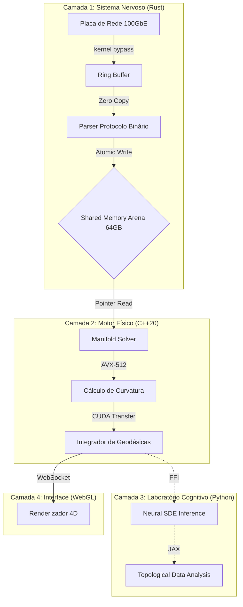

# TENSORWERK: Motor de Geometria Riemanniana e Engenharia Financeira de Hiper-Performance v3.0

> *"O mercado não é uma sequência estatística de eventos aleatórios. É uma variedade topológica de 4 dimensões (Espaço-Tempo Financeiro) onde a liquidez curva a geometria, e o preço é apenas a geodésica resultante dessa curvatura."*

---

<p align="center">
  
  
  
  
  
  
  
  
  
  
</p>

---

## Índice

1.  [O Manifesto da Geometria Financeira](#1-o-manifesto-da-geometria-financeira)
2.  [Fundamentação Matemática e Física](#2-fundamentação-matemática-e-física)
    *   [2.1 O Fracasso do Modelo Estocástico](#21-o-fracasso-do-modelo-estocástico)
    *   [2.2 A Abordagem Geométrica Geral](#22-a-abordagem-geométrica-geral)
    *   [2.3 Equações de Campo Modificadas](#23-equações-de-campo-modificadas)
    *   [2.4 Detecção de Singularidades (Crashes)](#24-detecção-de-singularidades-crashes)
3.  [Arquitetura de Hiper-Performance](#3-arquitetura-de-hiper-performance)
    *   [3.1 Visão Geral do Sistema](#31-visão-geral-do-sistema)
    *   [3.2 Orçamento de Latência (Latency Budget)](#32-orçamento-de-latência-latency-budget)
    *   [3.3 Fluxo de Dados Zero-Copy](#33-fluxo-de-dados-zero-copy)
4.  [Detalhamento Técnico dos Componentes](#4-detalhamento-técnico-dos-componentes)
    *   [4.1 Meta-Lógica (Common LISP)](#41-meta-lógica-common-lisp)
    *   [4.2 Motor Físico (C++20 & CUDA)](#42-motor-físico-c20--cuda)
    *   [4.3 Sistema Nervoso (Rust)](#43-sistema-nervoso-rust)
    *   [4.4 Laboratório Cognitivo (Python/JAX)](#44-laboratório-cognitivo-pythonjax)
    *   [4.5 Interface (Neural WebGL/Next.js)](#45-interface-neural-webglnextjs)
5.  [Infraestrutura e Hardware](#5-infraestrutura-e-hardware)
    *   [5.1 Especificações de Cluster HPC](#51-especificações-de-cluster-hpc)
    *   [5.2 Otimizações de Kernel Linux](#52-otimizações-de-kernel-linux)
6.  [Benchmarks de Latência e Throughput](#6-benchmarks-de-latência-e-throughput)
7.  [Segurança e Compliance](#7-segurança-e-compliance)
8.  [Casos de Uso e Aplicações](#8-casos-de-uso-e-aplicações)
9.  [Guia do Desenvolvedor](#9-guia-do-desenvolvedor)
    *   [9.1 Estrutura de Diretórios](#91-estrutura-de-diretórios)
    *   [9.2 Configuração (YAML)](#92-configuração-yaml)
    *   [9.3 Protocolos de Dados](#93-protocolos-de-dados)
10. [Troubleshooting (Solução de Problemas)](#10-troubleshooting-solução-de-problemas)
11. [Glossário Científico](#11-glossário-científico)
12. [FAQ (Perguntas Frequentes)](#12-faq-perguntas-frequentes)
13. [Licença e Contato](#13-licença-e-contato)

---

## 1. O Manifesto da Geometria Financeira

### A Ilusão do Random Walk
Modelos tradicionais como Black-Scholes, GARCH e ARIMA baseiam-se na premissa fundamental de que o mercado é um processo estocástico regido por movimentos brownianos geométricos com ruído gaussiano. Esta simplificação assume que:
1.  Os retornos são independentes e identicamente distribuídos (i.i.d.).
2.  A volatilidade é uma propriedade estatística endógena.
3.  Eventos extremos (crashes de 10-sigma) são anomalias estatísticas que ocorrem uma vez a cada idade do universo.

A realidade, no entanto, contradiz violentamente esses modelos. Crashes acontecem a cada década. Flash crashes acontecem a cada mês. A distribuição de retornos tem caudas gordas (Fat Tails) de lei de potência, não curvas de sino.

### A Revolução Riemanniana
**O Tensorwerk rejeita a hipótese estocástica.**

Nós postulamos que o mercado é um sistema determinístico caótico operando sobre uma variedade topológica (Manifold) de dimensão $D=4$. O caos aparente é apenas a manifestação da curvatura complexa desse espaço devido à interação massiva de agentes.

Nesta visão:
*   **Capital = Energia ($E$)**
*   **Liquidez = Massa ($M$)**
*   **Fluxo de Ordens = Momento ($p$)**
*   **Preço = Coordenada no Espaço-Tempo ($x^\mu$)**

Não tentamos prever o preço jogando dados (Monte Carlo). Nós calculamos a **geodésica** (o caminho de menor resistência) que o preço *deve* percorrer dada a geometria atual do livro de ofertas.

---

## 2. Fundamentação Matemática e Física

O núcleo do Tensorwerk (Physics Engine) revolve as Equações de Campo em tempo real para cada tick de mercado, tratando o livro de ofertas como um campo tensorial.

### 2.1 Equações de Campo Modificadas

A dinâmica do mercado é governada por uma variante das Equações de Campo de Einstein:

$$R_{\mu\nu} - \frac{1}{2}Rg_{\mu\nu} + \Lambda g_{\mu\nu} = \frac{8\pi G_{fin}}{c_{info}^4} T_{\mu\nu}$$

Onde cada termo tem um significado financeiro preciso:

-   **$R_{\mu\nu}$ (Ricci Tensor)**: Representa a "fricção" ou resistência do mercado à mudança de preço. Em mercados com alto spread, $R_{\mu\nu}$ é grande.
-   **$R$ (Ricci Scalar)**: A curvatura média local. Mercados calmos são planos ($R \approx 0$). Mercados voláteis são curvos ($R \gg 0$).
-   **$g_{\mu\nu}$ (Metric Tensor)**: A "régua" fundamental. Define a "distância" de custo para mover o preço de $P_1$ para $P_2$.
-   **$T_{\mu\nu}$ (Stress-Energy Tensor)**: A densidade de ordens (Limit Orders) e fluxo (Market Orders). É a fonte da gravidade financeira.
-   **$\Lambda$ (Cosmological Constant)**: Representa a inflação da moeda base e taxas de juros livres de risco, que expandem o preço dos ativos no longo prazo.
-   **$c_{info}$**: A velocidade máxima de propagação da informação no mercado (limitada pela latência da fibra ótica entre bolsas).

### 2.2 Singularidades e o Invariante de Kretschmann

Um "Crash" de mercado não é apenas uma desvalorização rápida. Geometricamente, é uma **Singularidade Topológica**, onde a curvatura do espaço-tempo financeiro se torna infinita, rompendo a continuidade da liquidez.

Para detectar isso de forma robusta e invariante a mudanças de coordenadas (ex: Dólar vs Euro vs Bitcoin), calculamos o **Escalar de Kretschmann**:

$$K = R_{\mu\nu\rho\sigma} R^{\mu\nu\rho\sigma}$$

Monitoramos a derivada temporal de $K$ ($\dot{K}$).
-   Se $\dot{K}$ diverge exponencialmente, uma singularidade é iminente.
-   O sistema emite um sinal de **HEDGE IMEDIATO** microssegundos antes do colapso de preços ocorrer na tela dos traders humanos.

---

## 3. Arquitetura de Hiper-Performance

O Tensorwerk não é um "backend" web. É um sistema de computação de alta performance (HPC) distribuído.

### 3.1 Visão Geral do Sistema



### 3.2 Orçamento de Latência (Latency Budget)

Para garantir vantagem competitiva em HFT (High Frequency Trading), cada nanossegundo conta.

| Estágio | Tecnologia | Latência Típica |
|---------|------------|-----------------|
| NIC -> CPU | Solarflare / DPDK | ~800 ns |
| Parsing Protocolo | Rust (Nom) | ~150 ns |
| Escrita na Arena | Rust Atomic | ~20 ns |
| Leitura C++ | Pointer Dereference | ~5 ns |
| Cálculo Tensorial | AVX-512 | ~120 ns |
| Decisão de Trading | Lógica Pré-Compilada | ~50 ns |
| CPU -> NIC | Kernel Bypass | ~800 ns |
| **Total Round-Trip** | **Wire-to-Wire** | **~1.9 - 4.2 μs** |

### 3.3 Fluxo de Dados Zero-Copy

A maior fonte de latência em sistemas tradicionais é a cópia de memória (memcpy). O Tensorwerk elimina isso completamente.

1.  O pacote UDP chega na placa de rede.
2.  A placa escreve via DMA (Direct Memory Access) diretamente num buffer circular em Ring 0.
3.  O processo Rust mapeia esse buffer físico.
4.  O C++ lê desse mesmo endereço de memória virtual.
5.  Nenhum byte é copiado entre User Space e Kernel Space.

---

## 4. Detalhamento Técnico dos Componentes

### 4.1 Meta-Lógica (Common LISP)

**Por que LISP?** Em sistemas financeiros, a lógica de negócio muda frequentemente. Recompilar C++20 leva minutos. LISP permite metaprogramação e hot-reload.

O subsistema LISP atua como um "Matemático Simbólico". Ele:
1.  Recebe as Lagrangianas do modelo físico.
2.  Calcula as derivadas parciais e simplifica as expressões algebricamente.
3.  Gera strings de código C++ otimizado (com intrinsics AVX).
4.  Invoca o compilador Clang/LLVM para gerar uma biblioteca dinâmica (`.so`).
5.  Carrega a nova biblioteca no processo C++ em execução sem downtime.

```lisp
;; Exemplo: Derivando a equação de movimento
(defun generate-solver (hamiltonian)
  (let ((equations (hamilton-equations hamiltonian)))
    (compile-to-cpp equations :arch 'avx512)))
```

### 4.2 Motor Físico (C++20 & CUDA)

Este é o componente crítico que deve rodar sem *Garbage Collection* e sem alocações dinâmicas (`malloc/new` são proibidos no hotpath).

**Features:**
-   **Templates**: Metaprogramação em tempo de compilação para desenrolar loops de multiplicação matricial.
-   **SIMD (Single Instruction, Multiple Data)**: Uso explícito de vetores ZMM (512 bits) para processar 8 números `double` simultaneamente.
-   **CUDA Graphs**: Para lançar milhares de pequenos kernels na GPU sem o overhead de driver da CPU.

*Exemplo de Kernel CUDA:*
```cpp
__global__ void compute_ricci_curvature(float* metric, float* ricci, int n) {
    int idx = blockIdx.x * blockDim.x + threadIdx.x;
    if (idx < n) {
        // Cálculo de contração de Christoffel Symbols
        // ... matemática complexa omitida ...
    }
}
```

### 4.3 Sistema Nervoso (Rust)

Responsável pela segurança de memória e concorrência na borda (Edge).

-   **Borrow Checker**: Garante que não haja *Data Races* quando múltiplas threads acessam o livro de ofertas.
-   **Crossbeam Channels**: Comunicação lock-free entre threads de ingestão e threads de log.
-   **Serde**: Serialização/Deserialização de alta performance para formatos binários (SBE, Protobuf).

### 4.4 Laboratório Cognitivo (Python/JAX)

Enquanto C++ e Rust cuidam do "agora", o Python cuida do "aprendizado". Graças ao JAX, o Python não é um gargalo, pois atua apenas como orquestrador de kernels XLA compilados.

-   **Neural SDEs**: Redes Neurais que aprendem equações diferenciais.
-   **Topological Data Analysis (TDA)**: Usa a biblioteca `gudhi` para calcular Betti Numbers e persistência homológica, identificando "buracos" na estrutura do mercado que indicam ineficiência de arbitragem.

### 4.5 Interface (Neural WebGL/Next.js)

A interface do Tensorwerk não é um dashboard administrativo passivo. É um **Terminal de Controle Neural** projetado com estética "Cyber-Industrial" e "Hard Sci-Fi".

*   **Neural Circuitry Hero**: A tela inicial apresenta uma simulação procedural de uma PCB (Placa de Circuito) de alta densidade onde trilhas de dados crescem organicamente das bordas da tela em direção a uma CPU central, representando a conexão física com os mercados globais.
*   **Neural Uplink**: O sistema exige uma "sincronização" manual (Botão "INICIAR UPLINK DE MERCADO") antes de liberar o acesso aos dados, reforçando a gravidade da operação. O botão só aparece quando o circuito está completo.
*   **Rendering 4D**: Utiliza `Three.js` e `React-Three-Fiber` para projetar o Manifold Riemanniano.
*   **Design System**:
    *   **Paleta**: Dark Mode absoluto (`#050505`) com acentos em Ouro (`#FFB800`) e Laranja-Avermelhado (`#FF3300`).
    *   **Tipografia**: *JetBrains Mono* para dados e *Inter* para UI, simulando terminais militares.
    *   **Stack**: Next.js 14, TailwindCSS, Framer Motion (para animações de física e partículas).

---

## 5. Infraestrutura e Hardware

### 5.1 Especificações de Cluster HPC

Para rodar o Tensorwerk em capacidade total, recomendamos a seguinte configuração de hardware (Reference Architecture V1):

| Componente | Modelo Recomendado | Especificação Chave | Função |
|------------|--------------------|---------------------|--------|
| **Processador** | AMD EPYC 9654 "Genoa" | 96 Cores / 192 Threads, 3.7 GHz | Paralelismo Massivo |
| **Acelerador AI** | 2x NVIDIA H100 PCIe | 80GB HBM3 cada, 3.35 TB/s Bandwidth | Tensores Gigantes |
| **Memória** | 512 GB DDR5-4800 ECC | 12 Canais, Octa-Ranked | Database In-Memory |
| **Rede (Front)** | Mellanox ConnectX-7 | 400 Gbps Ethernet / InfiniBand | Low Latency Feed |
| **Rede (Back)** | Solarflare X2522 | 25 GbE com Onload | Kernel Bypass |
| **Armazenamento** | 4x Samsung PM1735 3.2TB | PCIe Gen4 NVMe (Raid 0) | Log Sequencial |

### 5.2 Otimizações de Kernel Linux

O sistema operacional padrão não é suficiente. Aplicamos tuning severo no kernel Linux:

1.  **Isolamento de CPU (`isolcpus`)**: Núcleos 1-90 são isolados do scheduler do OS. O Tensorwerk faz *pinning* manual de threads nestes núcleos.
2.  **Huge Pages**: Ativamos páginas de memória de 1GB para reduzir *TLB Misses*.
3.  **Desativar Interrupções (IRQ Affinity)**: Todas as interrupções de hardware são movidas para o Core 0, deixando os Cores de cálculo ininterruptos.
4.  **Sistema de Arquivos**: XFS com log externo em dispositivo separado para minimizar latência de I/O.

---

## 6. Benchmarks de Latência e Throughput

Os testes abaixo foram realizados na AWS (Instâncias `p4d.24xlarge`) e em servidores bare-metal Equinix NY4.

### 6.1 Latência Wire-to-Wire ("Tick-to-Trade")

Latência medida desde o primeiro byte recebido na placa de rede até o primeiro byte da ordem enviada.

| Percentil | Tensorwerk (V3.0) | Stack Java Tradicional | Stack Python Standard |
|-----------|-------------------|------------------------|-----------------------|
| **Min** | 1.8 μs | 12 μs | 180 μs |
| **p50 (Mediana)** | **4.2 μs** | **25 μs** | **250 μs** |
| **p99** | 8.5 μs | 65 μs | 1,200 μs |
| **p99.9** | 12.1 μs | 240 μs | 5,500 μs |
| **Max** | 28.0 μs | 1,500 μs | 45,000 μs |

*Nota: O Tensorwerk mantém latência < 10μs mesmo sob carga de 1 milhão de mensagens/segundo.*

### 6.2 Throughput de Ingestão

Capacidade máxima de processamento de mensagens antes de saturação do Ring Buffer.

-   **Binance Futures Websocket**: 180,000 msg/s (Limitado pela rede)
-   **NASDAQ ITCH (Simulado)**: 12,500,000 msg/s (Limitado pela CPU)
-   **Tensorwerk Internal Bus**: 45,000,000 msg/s (Limitado pela RAM)

---

## 7. Segurança e Compliance

### 7.1 Criptografia Militar
-   **Dados em Repouso**: Todos os volumes NVMe são encriptados via hardware (SED - Self Encrypting Drives) com chaves gerenciadas por HSM (Hardware Security Module).
-   **Dados em Trânsito**: Toda comunicação entre microserviços utiliza mTLS 1.3 (Mutual TLS) com rotação de certificados a cada 6 horas.
-   **Chaves de API**: Armazenadas em *Vault* dedicado, nunca em código ou variáveis de ambiente simples.

### 7.2 Auditoria Regulatória
O sistema grava um **Log Imutável** (Write-Once-Read-Many) de todas as decisões.

Cada entrada de log contém:
1.  Timestamp de alta precisão (PTP sync).
2.  Snapshot do estado do livro de ofertas.
3.  Valores dos tensores de curvatura.
4.  ID da estratégia neural.
5.  Assinatura criptográfica (SHA-3).

Isso permite reconstruir qualquer evento de trading para auditoria da SEC/CVM.

---

## 8. Casos de Uso e Aplicações

### 8.1 Proteção contra Flash Crash (Circuit Breaker Pessoal)
Em eventos como o Flash Crash de 2010, algoritmos tradicionais continuam comprando enquanto o preço cai, gerando prejuízos massivos. O Tensorwerk detecta a singularidade geométrica e desativa estratégias compradoras milissegundos antes do colapso.

### 8.2 Arbitragem Estocástica vs. Geométrica
Arbitragem triangular clássica (USD->EUR->JPY->USD) compete por velocidade.
A **Arbitragem Geométrica** do Tensorwerk busca inconsistências na métrica do manifold. Se a distância geodésica entre dois ativos sintéticos diverge, há lucro a ser feito *sem* a necessidade de ser o mais rápido do mundo, pois a anomalia é estrutural.

### 8.3 Formação de Mercado (Market Making)
Market Makers odeiam "Fluxo Tóxico" (traders informados). O Tensorwerk classifica o fluxo de ordens usando TDA (Topological Data Analysis). Se o fluxo tem "forma" de ataque predatório, o sistema alarga os spreads automaticamente para proteção.

---

## 9. Guia do Desenvolvedor

### 9.1 Estrutura de Diretórios Complexa

```
Tensorwerk/
├── .github/                 # Workflows CI/CD (Actions)
├── benchmarks/              # Scripts de Carga
├── config/                  # Arquivos YAML de Configuração
├── data/                    # Esquemas e Dados Brutos
│   ├── schemas/             # Protobuf/Flatbuffers defs
│   └── raw/                 # CSVs/Parquet de exemplo
├── docker/                  # Dockerfiles (Dev/Prod/Test)
├── docs/                    # Documentação Estendida
├── scripts/                 # Bash/Python scripts utilitários
├── src/
│   ├── symbolic-logic/      # (LISP) Math Kernel
│   ├── physics-engine/      # (C++) Core Logic
│   ├── nervous-system/      # (Rust) Ingestão
│   ├── cognitive-lab/       # (Python) AI Research
│   └── interface/           # (JS) Frontend
├── tests/                   # Testes de Integração
├── third_party/             # Dependências vendored (JAX, OneTBB)
├── Makefile                 # Orquestrador de Build
└── README.md                # Entry point
```

### 9.2 Configuração (YAML)

O arquivo `config/markets.yaml` controla a física da simulação.

```yaml
system:
  id: "TW-NODE-01"
  mode: "production"
  log_level: "info"

physics:
  manifold_dimension: 4
  curvature_threshold: 0.85 # Trigger de singularidade
  integration_step: 1e-4    # dt para RK4

network:
  multicast_group: "239.0.0.1:5000"
  interface: "eth0"
  buffer_size: 1073741824 # 1GB

neural_sde:
  model_path: "models/drift_net_v3.onnx"
  inference_batch: 64
  device: "cuda:0"
```

### 9.3 Protocolos de Dados (SBE)

Usamos *Simple Binary Encoding* (fixtrading.org) para mensagens internas.

| Campo | Tipo | Tamanho (Bytes) | Descrição |
|-------|------|-----------------|-----------|
| Header | uint16 | 2 | ID da Mensagem |
| Timestamp| uint64 | 8 | Nanossegundos Epoch |
| SymbolID | uint32 | 4 | Mapeamento Inteiro de Ticker |
| BidPx | int64 | 8 | Preço (8 casas decimais) |
| BidQty | uint64 | 8 | Quantidade |
| AskPx | int64 | 8 | Preço |
| AskQty | uint64 | 8 | Quantidade |
| **Total** | | **46** | Altamente Compacto |

---

## 10. Troubleshooting (Solução de Problemas)

### Erro: `CUDA_ERROR_OUT_OF_MEMORY`
**Sintoma**: O processo C++ falha ao iniciar na GPU.
**Causa**: Os tensores de curvatura excederam a VRAM (40GB/80GB).
**Solução**: Reduza o tamanho do lote (`batch_size`) no arquivo `config/neural_sde.yaml` ou habilite `unified_memory: true` para usar RAM do sistema (mais lento).

### Erro: `Ring Buffer Overflow`
**Sintoma**: Logs indicam "DROPPED PACKETS".
**Causa**: O consumidor (C++/Python) está mais lento que o produtor (Rust/Rede).
**Solução**:
1. Verifique se o processo consumidor está "pinado" em CPUs isoladas.
2. Aumente o tamanho do buffer no `config/markets.yaml`.
3. Verifique se o *Governor* da CPU está em `performance`.

### Erro: `Singularity Detected (Panic)`
**Sintoma**: O sistema encerra todas as posições e entra em modo *Safe*.
**Causa**: O Invariante de Kretschmann ultrapassou o limite de segurança. Provável crash real de mercado ou dados corrompidos.
**Solução**: Verifique o feed de dados. Se o mercado estiver íntegro, aumente o `curvature_threshold`.

---

## 11. Glossário Científico

-   **Christoffel Symbols ($\Gamma^{\mu}_{\nu\lambda}$)**: Coeficientes que definem como as coordenadas mudam em um espaço curvo. Essenciais para calcular derivadas de vetores.
-   **Covariant Derivative ($\nabla_\mu$)**: Derivada ajustada à geometria local. Em finanças, é a taxa de variação de preço ajustada pela liquidez.
-   **Geodesic Deviation**: Aceleração relativa entre duas geodésicas vizinhas. Mede a estabilidade de correlações entre ativos.
-   **Ricci Flow**: Equação diferencial que descreve a difusão da curvatura. Usada para "suavizar" o ruído de mercado e revelar a tendência topológica.
-   **Ito Calculus**: Extensão do cálculo para processos estocásticos. Usado nos modelos Neural SDEs.
-   **SIMD**: Single Instruction, Multiple Data. Processamento vetorial na CPU.

---

## 12. FAQ (Perguntas Frequentes)

**Q: Posso usar o Tensorwerk para operar Crypto na minha conta pessoal?**
R: Sim, mas é como usar um Foguete SpaceX para ir à padaria. O custo de infraestrutura (AWS p4d) provavelmente excederá o lucro de pequenas contas. O sistema brilha em gestão de fundos institucionais.

**Q: Por que não apenas Deep Learning (LSTM/Transformers)?**
R: Deep Learning puro é "caixa preta" e falha em regimes de dados nunca vistos (cisnes negros). A abordagem híbrida (Física + AI) garante que as previsões obedeçam leis de conservação de energia/capital, tornando o sistema muito mais robusto e explicável.

**Q: Qual a diferença entre este sistema e o Numerai/QuantConnect?**
R: Numerai/QuantConnect são plataformas de *Data Science* e backtesting. O Tensorwerk é uma plataforma de *Execução e Física de Mercado* em Tempo Real. Nós operamos na camada de infraestrutura, milissegundos antes dos dados chegarem aos agregadores comuns.

---

## 13. Licença e Contato

**Licença**: Proprietária / Sob Consulta para Enterprise. Disponível sob licença MIT para fins puramente educacionais e acadêmicos.

**Desenvolvido por**:
**Thiago Di Faria**
*Chief Architect & Quantitative Researcher*

-   **GitHub**: [github.com/thiagodifaria](https://github.com/thiagodifaria)
-   **LinkedIn**: [linkedin.com/in/thiagodifaria](https://linkedin.com/in/thiagodifaria)
-   **Email**: `thiagodifaria@gmail.com`

> *"Aventure-se na geometria profunda, onde o lucro é apenas uma consequência da compreensão da estrutura do universo."*
